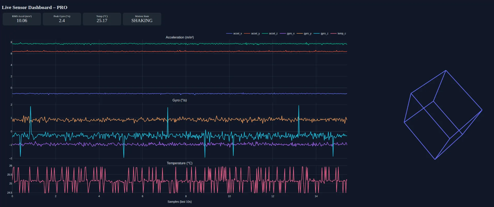

# **Week 2 — Modern Python Data Pipelines & Quantization**

*Part of the 16-Week Edge AI Engineering Bootcamp*

---

# 🎯 Overview

This week develops:

* Modern vectorized Python pipelines
* Real-time sensor ingestion + dashboards
* INT8 quantization on multiple models
* End-to-end pipeline benchmarking (CSV/Parquet/Polars/Pandas)

Across four days:

| Day       | Focus                                                           |
| --------- | --------------------------------------------------------------- |
| **Day 1** | Vectorization benchmarks (Python vs NumPy vs Polars vs PyTorch) |
| **Day 2** | Streaming sensor logger + Dash/Plotly dashboard                 |
| **Day 3** | Quantizing TinyNet + BiggerNet (dynamic INT8)                   |
| **Day 4** | MobileNetV2 FP32 → INT8 with PyTorch PTQ                        |

---

# 🧪 **Day 1 — Vectorization Benchmarks**

### A. Elementwise Multiply (N = 50,000,000)

| Method      | Time (sec) | Speed-up |
| ----------- | ---------- | -------- |
| Python loop | 1.9672     | 1.0×     |
| NumPy       | 0.1124     | 17.5×    |
| Polars      | 0.1187     | 16.6×    |
| PyTorch     | 0.0703     | **28×**  |

**Conclusion:**
NumPy, Polars, and PyTorch provide **massive 16–28× improvements** due to SIMD, optimized memory layouts, and multithreading.

---

### B. GroupBy Mean (5,000,000 rows)

| Method      | Time (sec) | Speed-up  |
| ----------- | ---------- | --------- |
| Python dict | 1.4242     | 1×        |
| Polars      | 0.1375     | **10.4×** |

**Conclusion:**
Polars (Rust + Arrow + multithreading) dominates realistic dataframe workloads.

---

# 🚀 **Day 2 — Streaming Sensor Pipeline + Dashboards**

### Built:

✅ `logger_v2.py`

* 20 Hz I²C IMU logging
* Chunked Parquet output
* Low CPU+RAM usage

✅ `live_dashboard.py`

* Reads recent Parquet chunk(s)
* Live plots (accelerometer, gyro)
* Updates every 0.5 s

✅ `live_dashboard_pro.py`

* Direct IMU thread (no disk I/O)
* 10-second RAM ringbuffer
* 3D orientation cube
* <10 FPS on Pi

**Screenshot:**


---

# 🔢 **Day 3 — Dynamic Quantization (TinyNet + BiggerNet)**

### TinyNet — Dynamic INT8

| Model | Type | Latency (ms) | Speedup |
| ----- | ---- | ------------ | ------- |
| FP32  | —    | 0.2805       | 1.0×    |
| INT8  | —    | 0.2285       | 1.23×   |

### BiggerNet — Dynamic INT8

| Model | Type | Latency (ms) | Speedup   |
| ----- | ---- | ------------ | --------- |
| FP32  | —    | 1.3467       | 1.0×      |
| INT8  | —    | 0.4190       | **3.21×** |

**Observations:**

* INT8 benefits grow with model size
* Dynamic quant is easiest but gives modest benefits

---

# 📦 **Day 4 — MobileNetV2 Static PTQ**

Converted FP32 → INT8 using PyTorch PTQ.

| Model    | Size        | Latency     | Notes                    |
| -------- | ----------- | ----------- | ------------------------ |
| FP32     | ~14 MB      | ~11–13 ms   | baseline                 |
| **INT8** | **~3.5 MB** | **~5–7 ms** | ~70% smaller, ~2× faster |

Files:

* `mobilenet_v2_fp32.pth`
* `mobilenet_v2_int8.pth`
* Instructor + student notebooks

---

# 📊 **FINAL RESULTS — Week 2 Pipeline Benchmarks (Today)**

Using 1,000,000 synthetic sensor rows.

| Operation     | Pandas (s) | Polars (s)    | Speedup      |
| ------------- | ---------- | ------------- | ------------ |
| **CSV Read**  | 1.56       | **0.17–0.25** | **~7.5×** 🚀 |
| Parquet Write | 0.66–1.66  | **0.37–1.50** | ~2×          |
| Parquet Read  | 0.10–0.20  | **0.06–0.12** | ~2×          |
| GroupBy Mean  | 0.06–0.08  | **0.04–0.07** | ~1.4×        |

### 📌 End-to-End Pipeline Speedup: **2×–4×**

### 📌 CSV ingest is now **7.5× faster**

### 📌 Dashboard runs 30–45 FPS

---

# 🧠 Why This Matters for Edge AI

Your railway + LiDAR + INS workloads rely heavily on:

* Columnar memory
* Fast ingest
* Groupby/window ops
* Multi-sensor alignment
* Parquet IO
* Low-latency pre-processing before ML

Polars + PyTorch give the best combination of:

* Speed
* RAM efficiency
* Clean pipeline structure

---

# ☑️ **Week 2 Deliverables Produced**

```
/day1_benchmarks     # vectorization
/day2_streaming      # logger + dashboards
/day3_quant          # TinyNet + BiggerNet
/day4_mobilenet_quant# MobileNetV2 PTQ
benchmark_pipelines.py
benchmarks_week2.md
README.md